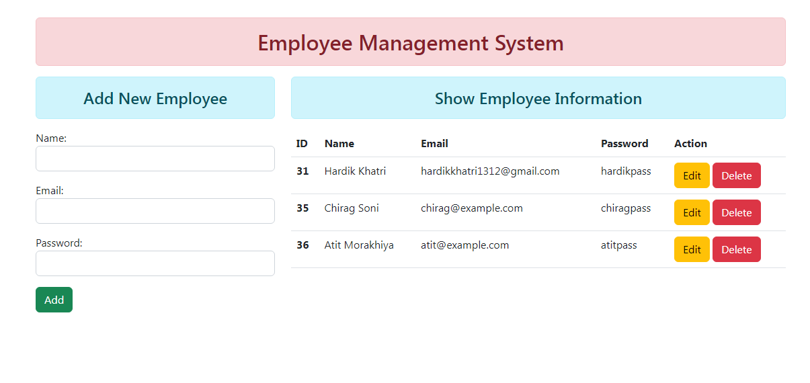
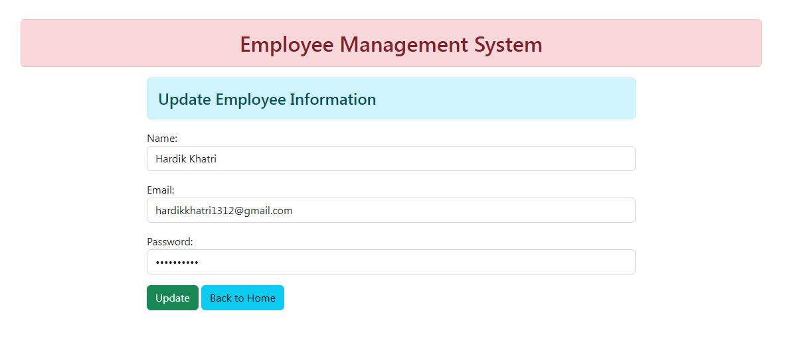

# Employee Management System
> Function based view Employee Management System using Django

## Table of Contents
* [General Info](#general-information)
* [Technologies Used](#technologies-used)
* [Features](#features)
* [Screenshots](#screenshots)
* [Usage](#usage)
* [Project Status](#project-status)
* [Acknowledgements](#acknowledgements)
* 

## General Information
- This is a simple CRUD project which can Create, Retrieve, Update, and Delete data.
- It can help you in keeping an employee database.
- I built this project to learn function based view, and modelForm in django.

## Technologies Used
- Python 3.8.6
- Django 4.0.4
- HTML5
- BOOTSTRAP 5.2.0-beta1
- JQuery 3.6.0

## Features
- It can Create, Read/Retrieve, Update, and Delete data.

## Screenshots

## Usage

`python manage.py runserver`

## Project Status
Project is: _complete_

## Acknowledgements
- This project was based on [this tutorial](https://youtu.be/OPc_oMgjhpM).
- Many thanks to Geeky Shows YouTube Channel
